# Design da Base de Dados — TMS (Transport Management System)

**Base de dados:** PostgreSQL 16
**Migrações:** Flyway
**Extensões:** `uuid-ossp`, `pg_trgm`

---

## 1. Convenções

| Convenção | Detalhe |
|-----------|---------|
| Chaves primárias | `UUID` gerado pela aplicação (`gen_random_uuid()` como default) |
| Timestamps | `TIMESTAMPTZ` (com fuso horário) em todas as tabelas |
| Auditoria | `created_at`, `updated_at`, `created_by`, `updated_by` em todas as tabelas |
| Soft delete | `deleted_at TIMESTAMPTZ`, `deleted_by VARCHAR(100)` nas entidades principais |
| Enums | `VARCHAR` com `CHECK` constraint |
| JSON | `JSONB` para valores de auditoria |
| Nomenclatura | `snake_case` para tabelas e colunas |
| Índices | `idx_{tabela}_{coluna(s)}` |
| FKs | `{tabela_referenciada_singular}_id` |

---

## 2. Sequência de Migrações Flyway

| Versão | Ficheiro | Descrição | Módulo |
|--------|----------|-----------|--------|
| V0 | `V0__init_extensions.sql` | Extensões `uuid-ossp` e `pg_trgm` | Infraestrutura |
| V1 | `V1__create_vehicles.sql` | Tabela `vehicles` | vehicle |
| V2 | `V2__create_drivers.sql` | Tabela `drivers` | driver |
| V3 | `V3__create_activities.sql` | Tabela `activities` | activity |
| V3b | `V3b__create_activity_events.sql` | Tabela `activity_events` | activity |
| V4 | `V4__create_vehicle_documents.sql` | Tabela `vehicle_documents` | vehicle |
| V4b | `V4b__create_vehicle_accessories.sql` | Tabela `vehicle_accessories` | vehicle |
| V4c | `V4c__create_driver_documents.sql` | Tabela `driver_documents` | driver |
| V5 | `V5__create_maintenance_records.sql` | Tabela `maintenance_records` | vehicle |
| V6 | `V6__create_checklists.sql` | Tabelas `checklist_templates`, `checklist_template_items`, `checklist_inspections`, `checklist_inspection_items` | vehicle |
| V7 | `V7__create_alerts.sql` | Tabelas `alerts` e `alert_configurations` | alert |
| V8 | `V8__create_audit_logs.sql` | Tabela `audit_logs` (imutável) | audit |
| V9 | `V9__create_files.sql` | Tabela `files` | integration |
| V10 | `V10__create_indexes.sql` | Todos os índices de performance | Infraestrutura |
| V11 | `V11__create_hr_module.sql` | Tabelas `employee_functions`, `employees`, `salary_payments` + coluna `employee_id` em `drivers` | hr |

---

## 3. DDL Completo

### 3.1 vehicles

```sql
CREATE TABLE vehicles (
    id                  UUID PRIMARY KEY DEFAULT gen_random_uuid(),
    plate               VARCHAR(20)  NOT NULL UNIQUE,
    brand               VARCHAR(100) NOT NULL,
    model               VARCHAR(100) NOT NULL,
    vehicle_type        VARCHAR(100) NOT NULL,
    capacity            INTEGER      NOT NULL,
    activity_location   VARCHAR(200) NOT NULL,
    activity_start_date DATE         NOT NULL,
    status              VARCHAR(30)  NOT NULL DEFAULT 'DISPONIVEL'
                            CHECK (status IN ('DISPONIVEL','INDISPONIVEL','EM_MANUTENCAO','ABATIDA')),
    current_driver_id   UUID         REFERENCES drivers(id) ON DELETE SET NULL,
    notes               TEXT,
    created_at          TIMESTAMPTZ  NOT NULL DEFAULT NOW(),
    updated_at          TIMESTAMPTZ  NOT NULL DEFAULT NOW(),
    created_by          VARCHAR(100) NOT NULL,
    updated_by          VARCHAR(100) NOT NULL,
    deleted_at          TIMESTAMPTZ,
    deleted_by          VARCHAR(100)
);
```

### 3.2 vehicle_accessories

```sql
CREATE TABLE vehicle_accessories (
    id               UUID PRIMARY KEY DEFAULT gen_random_uuid(),
    vehicle_id       UUID         NOT NULL REFERENCES vehicles(id) ON DELETE CASCADE,
    accessory_type   VARCHAR(50)  NOT NULL
                         CHECK (accessory_type IN ('MACACO','RODA_SOBRESSALENTE','TRIANGULO',
                                                   'EXTINTOR','KIT_PRIMEIROS_SOCORROS',
                                                   'COLETE_REFLETOR','OUTRO')),
    status           VARCHAR(20)  NOT NULL DEFAULT 'PRESENTE'
                         CHECK (status IN ('PRESENTE','AUSENTE','DANIFICADO')),
    last_checked_at  TIMESTAMPTZ,
    last_checked_by  VARCHAR(100),
    notes            TEXT,
    created_at       TIMESTAMPTZ  NOT NULL DEFAULT NOW(),
    updated_at       TIMESTAMPTZ  NOT NULL DEFAULT NOW(),
    created_by       VARCHAR(100) NOT NULL,
    updated_by       VARCHAR(100) NOT NULL,
    UNIQUE (vehicle_id, accessory_type)
);
```

### 3.3 vehicle_documents

```sql
CREATE TABLE vehicle_documents (
    id               UUID PRIMARY KEY DEFAULT gen_random_uuid(),
    vehicle_id       UUID         NOT NULL REFERENCES vehicles(id) ON DELETE CASCADE,
    document_type    VARCHAR(30)  NOT NULL
                         CHECK (document_type IN ('LIVRETE','INSPECAO','SEGURO',
                                                  'LICENCA','MANIFESTO','TAXA_RADIO','OUTRO')),
    document_number  VARCHAR(100),
    issue_date       DATE,
    expiry_date      DATE,
    issuing_entity   VARCHAR(200),
    status           VARCHAR(30)  NOT NULL DEFAULT 'VALIDO'
                         CHECK (status IN ('VALIDO','EXPIRADO','PENDENTE_RENOVACAO','CANCELADO')),
    notes            TEXT,
    file_id          UUID         REFERENCES files(id) ON DELETE SET NULL,
    created_at       TIMESTAMPTZ  NOT NULL DEFAULT NOW(),
    updated_at       TIMESTAMPTZ  NOT NULL DEFAULT NOW(),
    created_by       VARCHAR(100) NOT NULL,
    updated_by       VARCHAR(100) NOT NULL,
    deleted_at       TIMESTAMPTZ,
    deleted_by       VARCHAR(100)
);
```

### 3.4 drivers

```sql
CREATE TABLE drivers (
    id                   UUID PRIMARY KEY DEFAULT gen_random_uuid(),
    full_name            VARCHAR(200) NOT NULL,
    phone                VARCHAR(30)  NOT NULL,
    address              TEXT         NOT NULL,
    id_number            VARCHAR(50)  NOT NULL UNIQUE,
    license_number       VARCHAR(50)  NOT NULL UNIQUE,
    license_category     VARCHAR(20)  NOT NULL,
    license_issue_date   DATE         NOT NULL,
    license_expiry_date  DATE         NOT NULL,
    activity_location    VARCHAR(200) NOT NULL,
    status               VARCHAR(20)  NOT NULL DEFAULT 'ATIVO'
                             CHECK (status IN ('ATIVO','INATIVO','SUSPENSO')),
    employee_id          UUID         REFERENCES employees(id) ON DELETE SET NULL,
    notes                TEXT,
    created_at           TIMESTAMPTZ  NOT NULL DEFAULT NOW(),
    updated_at           TIMESTAMPTZ  NOT NULL DEFAULT NOW(),
    created_by           VARCHAR(100) NOT NULL,
    updated_by           VARCHAR(100) NOT NULL,
    deleted_at           TIMESTAMPTZ,
    deleted_by           VARCHAR(100)
);
```

### 3.5 driver_documents

```sql
CREATE TABLE driver_documents (
    id               UUID PRIMARY KEY DEFAULT gen_random_uuid(),
    driver_id        UUID         NOT NULL REFERENCES drivers(id) ON DELETE CASCADE,
    document_type    VARCHAR(30)  NOT NULL
                         CHECK (document_type IN ('CARTA_CONDUCAO','BILHETE_IDENTIDADE','OUTRO')),
    document_number  VARCHAR(100),
    issue_date       DATE,
    expiry_date      DATE,
    issuing_entity   VARCHAR(200),
    category         VARCHAR(20),
    status           VARCHAR(30)  NOT NULL DEFAULT 'VALIDO'
                         CHECK (status IN ('VALIDO','EXPIRADO','PENDENTE_RENOVACAO','CANCELADO')),
    notes            TEXT,
    file_id          UUID         REFERENCES files(id) ON DELETE SET NULL,
    created_at       TIMESTAMPTZ  NOT NULL DEFAULT NOW(),
    updated_at       TIMESTAMPTZ  NOT NULL DEFAULT NOW(),
    created_by       VARCHAR(100) NOT NULL,
    updated_by       VARCHAR(100) NOT NULL,
    deleted_at       TIMESTAMPTZ,
    deleted_by       VARCHAR(100)
);
```

### 3.6 maintenance_records

```sql
CREATE TABLE maintenance_records (
    id                       UUID PRIMARY KEY DEFAULT gen_random_uuid(),
    vehicle_id               UUID           NOT NULL REFERENCES vehicles(id) ON DELETE CASCADE,
    maintenance_type         VARCHAR(20)    NOT NULL
                                 CHECK (maintenance_type IN ('PREVENTIVA','CORRETIVA')),
    performed_at             DATE           NOT NULL,
    mileage_at_service       INTEGER,
    description              TEXT           NOT NULL,
    supplier                 VARCHAR(200),
    total_cost               NUMERIC(10,2),
    parts_replaced           TEXT,
    next_maintenance_date    DATE,
    next_maintenance_mileage INTEGER,
    responsible_user         VARCHAR(100)   NOT NULL,
    created_at               TIMESTAMPTZ    NOT NULL DEFAULT NOW(),
    updated_at               TIMESTAMPTZ    NOT NULL DEFAULT NOW(),
    created_by               VARCHAR(100)   NOT NULL,
    updated_by               VARCHAR(100)   NOT NULL
);
```

### 3.7 checklist_templates e checklist_template_items

```sql
CREATE TABLE checklist_templates (
    id           UUID PRIMARY KEY DEFAULT gen_random_uuid(),
    vehicle_type VARCHAR(100) NOT NULL,
    name         VARCHAR(200) NOT NULL,
    is_active    BOOLEAN      NOT NULL DEFAULT TRUE,
    created_at   TIMESTAMPTZ  NOT NULL DEFAULT NOW(),
    updated_at   TIMESTAMPTZ  NOT NULL DEFAULT NOW(),
    created_by   VARCHAR(100) NOT NULL,
    updated_by   VARCHAR(100) NOT NULL
);

CREATE TABLE checklist_template_items (
    id            UUID PRIMARY KEY DEFAULT gen_random_uuid(),
    template_id   UUID         NOT NULL REFERENCES checklist_templates(id) ON DELETE CASCADE,
    item_name     VARCHAR(200) NOT NULL,
    is_critical   BOOLEAN      NOT NULL DEFAULT FALSE,
    display_order INTEGER      NOT NULL DEFAULT 0,
    created_at    TIMESTAMPTZ  NOT NULL DEFAULT NOW(),
    updated_at    TIMESTAMPTZ  NOT NULL DEFAULT NOW(),
    created_by    VARCHAR(100) NOT NULL,
    updated_by    VARCHAR(100) NOT NULL
);
```

### 3.8 checklist_inspections e checklist_inspection_items

```sql
CREATE TABLE checklist_inspections (
    id           UUID PRIMARY KEY DEFAULT gen_random_uuid(),
    vehicle_id   UUID         NOT NULL REFERENCES vehicles(id) ON DELETE CASCADE,
    activity_id  UUID         REFERENCES activities(id) ON DELETE SET NULL,
    template_id  UUID         NOT NULL REFERENCES checklist_templates(id),
    performed_by VARCHAR(100) NOT NULL,
    performed_at TIMESTAMPTZ  NOT NULL,
    notes        TEXT,
    created_at   TIMESTAMPTZ  NOT NULL DEFAULT NOW(),
    updated_at   TIMESTAMPTZ  NOT NULL DEFAULT NOW(),
    created_by   VARCHAR(100) NOT NULL,
    updated_by   VARCHAR(100) NOT NULL
);

CREATE TABLE checklist_inspection_items (
    id               UUID PRIMARY KEY DEFAULT gen_random_uuid(),
    inspection_id    UUID         NOT NULL REFERENCES checklist_inspections(id) ON DELETE CASCADE,
    template_item_id UUID         REFERENCES checklist_template_items(id) ON DELETE SET NULL,
    item_name        VARCHAR(200) NOT NULL,
    is_critical      BOOLEAN      NOT NULL DEFAULT FALSE,
    status           VARCHAR(20)  NOT NULL
                         CHECK (status IN ('OK','AVARIA','FALTA')),
    notes            TEXT,
    created_at       TIMESTAMPTZ  NOT NULL DEFAULT NOW(),
    updated_by       VARCHAR(100) NOT NULL
);
```

### 3.9 activities

```sql
CREATE TABLE activities (
    id                          UUID PRIMARY KEY DEFAULT gen_random_uuid(),
    code                        VARCHAR(30)  NOT NULL UNIQUE,
    title                       VARCHAR(300) NOT NULL,
    activity_type               VARCHAR(100) NOT NULL,
    location                    VARCHAR(300) NOT NULL,
    planned_start               TIMESTAMPTZ  NOT NULL,
    planned_end                 TIMESTAMPTZ  NOT NULL,
    actual_start                TIMESTAMPTZ,
    actual_end                  TIMESTAMPTZ,
    priority                    VARCHAR(20)  NOT NULL DEFAULT 'NORMAL'
                                    CHECK (priority IN ('BAIXA','NORMAL','ALTA','URGENTE')),
    status                      VARCHAR(20)  NOT NULL DEFAULT 'PLANEADA'
                                    CHECK (status IN ('PLANEADA','EM_CURSO','SUSPENSA','CONCLUIDA','CANCELADA')),
    vehicle_id                  UUID         REFERENCES vehicles(id) ON DELETE SET NULL,
    driver_id                   UUID         REFERENCES drivers(id) ON DELETE SET NULL,
    description                 TEXT,
    notes                       TEXT,
    rh_override_justification   TEXT,
    created_at                  TIMESTAMPTZ  NOT NULL DEFAULT NOW(),
    updated_at                  TIMESTAMPTZ  NOT NULL DEFAULT NOW(),
    created_by                  VARCHAR(100) NOT NULL,
    updated_by                  VARCHAR(100) NOT NULL,
    deleted_at                  TIMESTAMPTZ,
    deleted_by                  VARCHAR(100)
);
```

### 3.10 activity_events

```sql
CREATE TABLE activity_events (
    id               UUID PRIMARY KEY DEFAULT gen_random_uuid(),
    activity_id      UUID         NOT NULL REFERENCES activities(id) ON DELETE CASCADE,
    event_type       VARCHAR(50)  NOT NULL,
    previous_status  VARCHAR(20),
    new_status       VARCHAR(20),
    performed_by     VARCHAR(100) NOT NULL,
    performed_at     TIMESTAMPTZ  NOT NULL DEFAULT NOW(),
    notes            TEXT,
    created_at       TIMESTAMPTZ  NOT NULL DEFAULT NOW(),
    created_by       VARCHAR(100) NOT NULL
);
```

### 3.11 alerts e alert_configurations

```sql
CREATE TABLE alerts (
    id           UUID PRIMARY KEY DEFAULT gen_random_uuid(),
    alert_type   VARCHAR(50)  NOT NULL
                     CHECK (alert_type IN ('DOCUMENT_EXPIRING','DOCUMENT_EXPIRED',
                                           'MAINTENANCE_DUE','MAINTENANCE_OVERDUE',
                                           'CHECKLIST_FAILURE')),
    severity     VARCHAR(20)  NOT NULL CHECK (severity IN ('INFO','AVISO','CRITICO')),
    entity_type  VARCHAR(50)  NOT NULL,
    entity_id    UUID         NOT NULL,
    title        VARCHAR(300) NOT NULL,
    message      TEXT         NOT NULL,
    is_resolved  BOOLEAN      NOT NULL DEFAULT FALSE,
    resolved_at  TIMESTAMPTZ,
    resolved_by  VARCHAR(100),
    created_at   TIMESTAMPTZ  NOT NULL DEFAULT NOW(),
    updated_at   TIMESTAMPTZ  NOT NULL DEFAULT NOW(),
    created_by   VARCHAR(100) NOT NULL,
    updated_by   VARCHAR(100) NOT NULL
);

CREATE TABLE alert_configurations (
    id                   UUID PRIMARY KEY DEFAULT gen_random_uuid(),
    alert_type           VARCHAR(50)  NOT NULL,
    entity_type          VARCHAR(50)  NOT NULL,
    days_before_warning  INTEGER      NOT NULL DEFAULT 30,
    days_before_critical INTEGER      NOT NULL DEFAULT 7,
    is_active            BOOLEAN      NOT NULL DEFAULT TRUE,
    created_at           TIMESTAMPTZ  NOT NULL DEFAULT NOW(),
    updated_at           TIMESTAMPTZ  NOT NULL DEFAULT NOW(),
    created_by           VARCHAR(100) NOT NULL,
    updated_by           VARCHAR(100) NOT NULL,
    UNIQUE (alert_type, entity_type)
);
```

### 3.12 audit_logs (imutável)

```sql
CREATE TABLE audit_logs (
    id               UUID PRIMARY KEY DEFAULT gen_random_uuid(),
    entity_type      VARCHAR(100) NOT NULL,
    entity_id        UUID         NOT NULL,
    operation        VARCHAR(20)  NOT NULL
                         CHECK (operation IN ('CRIACAO','ATUALIZACAO','ELIMINACAO')),
    performed_by     VARCHAR(100) NOT NULL,
    performed_at     TIMESTAMPTZ  NOT NULL DEFAULT NOW(),
    ip_address       VARCHAR(45),
    previous_values  JSONB,
    new_values       JSONB,
    created_at       TIMESTAMPTZ  NOT NULL DEFAULT NOW()
    -- SEM updated_at, SEM deleted_at — registo imutável
);
```

### 3.13 files

```sql
CREATE TABLE files (
    id                UUID PRIMARY KEY DEFAULT gen_random_uuid(),
    original_filename VARCHAR(500) NOT NULL,
    storage_key       VARCHAR(500) NOT NULL UNIQUE,
    content_type      VARCHAR(100) NOT NULL,
    size_bytes        BIGINT       NOT NULL,
    uploaded_by       VARCHAR(100) NOT NULL,
    uploaded_at       TIMESTAMPTZ  NOT NULL DEFAULT NOW(),
    created_at        TIMESTAMPTZ  NOT NULL DEFAULT NOW()
);
```

### 3.14 employee_functions, employees, salary_payments (módulo hr)

```sql
CREATE TABLE employee_functions (
    id          UUID PRIMARY KEY DEFAULT gen_random_uuid(),
    code        VARCHAR(50)  NOT NULL UNIQUE,
    name        VARCHAR(150) NOT NULL,
    description TEXT,
    is_active   BOOLEAN      NOT NULL DEFAULT TRUE,
    created_at  TIMESTAMPTZ  NOT NULL DEFAULT NOW(),
    updated_at  TIMESTAMPTZ  NOT NULL DEFAULT NOW(),
    created_by  VARCHAR(100) NOT NULL,
    updated_by  VARCHAR(100) NOT NULL
);

CREATE TABLE employees (
    id                UUID PRIMARY KEY DEFAULT gen_random_uuid(),
    employee_number   VARCHAR(50)   NOT NULL UNIQUE,
    full_name         VARCHAR(200)  NOT NULL,
    phone             VARCHAR(50),
    email             VARCHAR(150),
    id_number         VARCHAR(100)  UNIQUE,
    function_id       UUID          REFERENCES employee_functions(id),
    status            VARCHAR(30)   NOT NULL
                          CHECK (status IN ('ACTIVE','INACTIVE','SUSPENDED','TERMINATED')),
    hire_date         DATE,
    termination_date  DATE,
    base_salary       NUMERIC(15,2),
    currency          VARCHAR(3)    NOT NULL DEFAULT 'MZN',
    notes             TEXT,
    created_at        TIMESTAMPTZ   NOT NULL DEFAULT NOW(),
    updated_at        TIMESTAMPTZ   NOT NULL DEFAULT NOW(),
    created_by        VARCHAR(100)  NOT NULL,
    updated_by        VARCHAR(100)  NOT NULL,
    deleted_at        TIMESTAMPTZ,
    deleted_by        VARCHAR(100)
);

CREATE TABLE salary_payments (
    id              UUID PRIMARY KEY DEFAULT gen_random_uuid(),
    employee_id     UUID           NOT NULL REFERENCES employees(id),
    period_year     INTEGER        NOT NULL,
    period_month    INTEGER        NOT NULL CHECK (period_month BETWEEN 1 AND 12),
    gross_amount    NUMERIC(15,2)  NOT NULL,
    net_amount      NUMERIC(15,2)  NOT NULL,
    paid_amount     NUMERIC(15,2)  NOT NULL,
    currency        VARCHAR(3)     NOT NULL DEFAULT 'MZN',
    payment_date    DATE           NOT NULL,
    payment_method  VARCHAR(30)    NOT NULL
                        CHECK (payment_method IN ('BANK_TRANSFER','CASH','MOBILE_MONEY','OTHER')),
    reference       VARCHAR(100),
    status          VARCHAR(30)    NOT NULL CHECK (status IN ('PAID','CANCELLED')),
    notes           TEXT,
    created_at      TIMESTAMPTZ    NOT NULL DEFAULT NOW(),
    updated_at      TIMESTAMPTZ    NOT NULL DEFAULT NOW(),
    created_by      VARCHAR(100)   NOT NULL,
    updated_by      VARCHAR(100)   NOT NULL,
    UNIQUE (employee_id, period_year, period_month)
);
```

---

## 4. Índices

| Nome | Tabela | Colunas | Tipo | Propósito |
|------|--------|---------|------|-----------|
| `idx_vehicles_plate` | vehicles | plate | B-tree | Pesquisa exacta por matrícula |
| `idx_vehicles_status` | vehicles | status | B-tree (partial: deleted_at IS NULL) | Filtro por estado |
| `idx_vehicles_location` | vehicles | activity_location | B-tree (partial: deleted_at IS NULL) | Filtro por local |
| `idx_vehicles_plate_trgm` | vehicles | plate | GIN (gin_trgm_ops) | Pesquisa parcial por matrícula |
| `idx_vehicle_docs_vehicle` | vehicle_documents | vehicle_id | B-tree (partial: deleted_at IS NULL) | Documentos por viatura |
| `idx_vehicle_docs_expiry` | vehicle_documents | expiry_date | B-tree (partial: deleted_at IS NULL AND status != 'CANCELADO') | Job de alertas de expiração |
| `idx_vehicle_docs_status` | vehicle_documents | status | B-tree (partial: deleted_at IS NULL) | Filtro por estado |
| `idx_vehicle_accessories_vehicle` | vehicle_accessories | vehicle_id | B-tree | Acessórios por viatura |
| `idx_maintenance_vehicle` | maintenance_records | vehicle_id | B-tree | Manutenções por viatura |
| `idx_maintenance_performed_at` | maintenance_records | performed_at | B-tree | Ordenação cronológica |
| `idx_maintenance_next_date` | maintenance_records | next_maintenance_date | B-tree (partial: NOT NULL) | Job de alertas de manutenção |
| `idx_drivers_status` | drivers | status | B-tree (partial: deleted_at IS NULL) | Filtro por estado |
| `idx_drivers_license_expiry` | drivers | license_expiry_date | B-tree (partial: deleted_at IS NULL) | Job de alertas de carta |
| `idx_drivers_location` | drivers | activity_location | B-tree (partial: deleted_at IS NULL) | Filtro por local |
| `idx_drivers_employee` | drivers | employee_id | B-tree | Ligação motorista-funcionário |
| `idx_driver_docs_driver` | driver_documents | driver_id | B-tree (partial: deleted_at IS NULL) | Documentos por motorista |
| `idx_driver_docs_expiry` | driver_documents | expiry_date | B-tree (partial: deleted_at IS NULL AND status != 'CANCELADO') | Job de alertas de expiração |
| `idx_checklist_template_items_template` | checklist_template_items | template_id | B-tree | Itens por template |
| `idx_checklist_inspections_vehicle` | checklist_inspections | vehicle_id | B-tree | Checklists por viatura |
| `idx_checklist_inspections_activity` | checklist_inspections | activity_id | B-tree | Checklists por atividade |
| `idx_checklist_inspection_items_insp` | checklist_inspection_items | inspection_id | B-tree | Itens por inspeção |
| `idx_activities_status` | activities | status | B-tree (partial: deleted_at IS NULL) | Filtro por estado |
| `idx_activities_vehicle` | activities | vehicle_id | B-tree (partial: deleted_at IS NULL) | Atividades por viatura |
| `idx_activities_driver` | activities | driver_id | B-tree (partial: deleted_at IS NULL) | Atividades por motorista |
| `idx_activities_planned_start` | activities | planned_start | B-tree (partial: deleted_at IS NULL) | Deteção de conflitos de alocação |
| `idx_activities_code` | activities | code | B-tree | Pesquisa por código |
| `idx_activity_events_activity` | activity_events | activity_id | B-tree | Eventos por atividade |
| `idx_alerts_entity` | alerts | (entity_type, entity_id) | B-tree | Alertas por entidade |
| `idx_alerts_is_resolved` | alerts | is_resolved | B-tree (partial: is_resolved = FALSE) | Alertas ativos |
| `idx_alerts_severity` | alerts | severity | B-tree (partial: is_resolved = FALSE) | Filtro por severidade |
| `idx_alerts_dedup` | alerts | (alert_type, entity_id) | UNIQUE (partial: is_resolved = FALSE) | Deduplicação de alertas |
| `idx_audit_entity` | audit_logs | (entity_type, entity_id) | B-tree | Auditoria por entidade |
| `idx_audit_performed_by` | audit_logs | performed_by | B-tree | Auditoria por utilizador |
| `idx_audit_performed_at` | audit_logs | performed_at | B-tree | Auditoria por data |
| `idx_audit_operation` | audit_logs | operation | B-tree | Filtro por tipo de operação |
| `idx_employee_functions_code` | employee_functions | code | B-tree | Pesquisa por código de função |
| `idx_employees_number` | employees | employee_number | B-tree | Pesquisa por número de funcionário |
| `idx_employees_status` | employees | status | B-tree (partial: deleted_at IS NULL) | Filtro por estado |
| `idx_employees_function` | employees | function_id | B-tree | Funcionários por função |
| `idx_salary_payments_employee` | salary_payments | employee_id | B-tree | Pagamentos por funcionário |
| `idx_salary_payments_period` | salary_payments | (period_year, period_month) | B-tree | Pagamentos por período |
| `idx_salary_payments_status` | salary_payments | status | B-tree | Filtro por estado de pagamento |

---

## 5. Diagrama ERD (simplificado)

```mermaid
erDiagram
    vehicles ||--o{ vehicle_accessories : "tem"
    vehicles ||--o{ vehicle_documents : "tem"
    vehicles ||--o{ maintenance_records : "tem"
    vehicles ||--o{ checklist_inspections : "tem"
    vehicles }o--o| drivers : "motorista atual"
    drivers ||--o{ driver_documents : "tem"
    drivers }o--o| employees : "associado a"
    activities }o--o| vehicles : "usa"
    activities }o--o| drivers : "conduzida por"
    activities ||--o{ activity_events : "tem"
    activities ||--o{ checklist_inspections : "associada a"
    checklist_templates ||--o{ checklist_template_items : "contém"
    checklist_inspections ||--o{ checklist_inspection_items : "contém"
    checklist_inspections }o--|| checklist_templates : "baseada em"
    vehicle_documents }o--o| files : "anexo"
    driver_documents }o--o| files : "anexo"
    employees }o--o| employee_functions : "tem função"
    employees ||--o{ salary_payments : "recebe"
```


